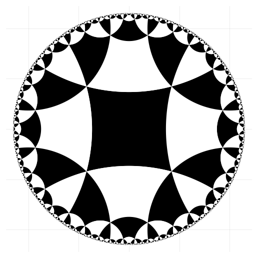

## Numerically Accurate Hyperbolic Embeddings Using Tiling-Based Models



#### Authors:
* [Tao Yu](http://www.cs.cornell.edu/~tyu/)
* [Christopher De Sa](http://www.cs.cornell.edu/~cdesa/)

### Introduction
This repo contains official code and models for the NeurIPS 2019 paper,
[Numerically Accurate Hyperbolic Embeddings Using Tiling-Based Models](https://papers.nips.cc/paper/8476-numerically-accurate-hyperbolic-embeddings-using-tiling-based-models.pdf).
Our method can compress a poincare embedding on WordNet Nouns down to 2% of the original size.


### Dependencies
* Julia >= 1.0.1
* StaticArrays
* LinearAlgebra
* DelimitedFiles
* ArgParse

### Data
We include embeddings of three datasets in dataset folder: Gr-QC, Bio-yeast, and WordNet Nouns. Specifically, download
`wordnet2h-comb1.emb` [here](https://drive.google.com/file/d/1Q8qPNxq_GCLv2grRp7ycOpQxHZzoJ9JI/view?usp=sharing).

### Structure and Usage:
`Hyperbolic.jl` contains function required for compression;
`group_compress.jl` to compress an existing hyperbolic embedding into L-tiling models (VBW encoding)

To compress a existing model, run:
```
$ julia group_compress.jl [-h] --dataset DATASET --compr_dir COMPR_DIR [--model MODEL]
optional arguments:
  -h, --help            show this help message and exit
  --dataset DATASET     dataset to compress: gr-qc | wordnet | bio-yeast
  --compr_dir COMPR_DIR  directory to store compressed L-tiling model, txt format
  --model MODEL           what models to be compressed, poincare or lorentz"
```

### Citation
If you use our code or wish to refer to our results, please use the following BibTex entry:
```
@InProceedings{Yu_2019_NeurIPS_tiling,
  author = {Yu, Tao and De Sa, Christopher M},
  title = {Numerically Accurate Hyperbolic Embeddings Using Tiling-Based Models},
  booktitle = {Proceedings of the 33rd Conference on Neural Information Processing Systems (NeurIPS 2019)},
  month = {Oct.},
  year = {2019}
}
```
